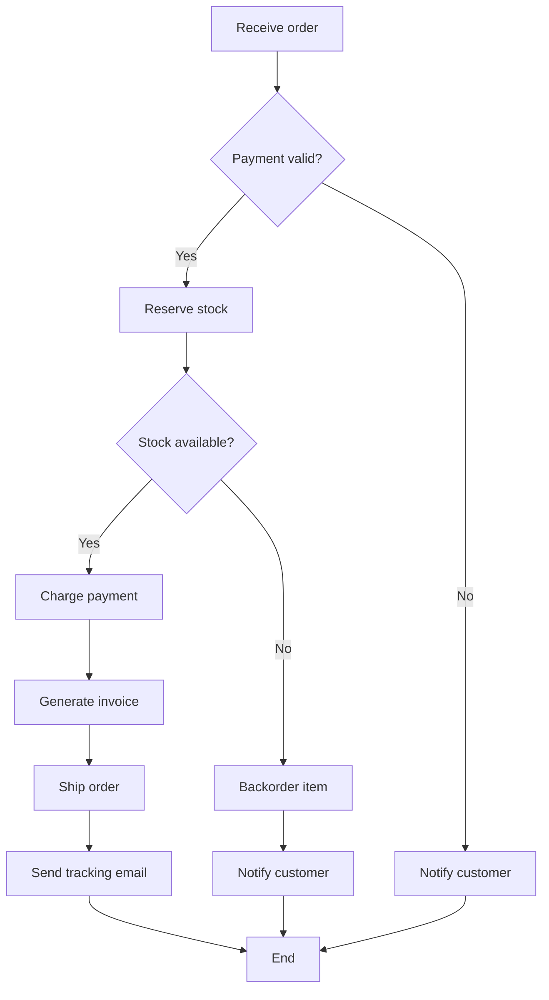
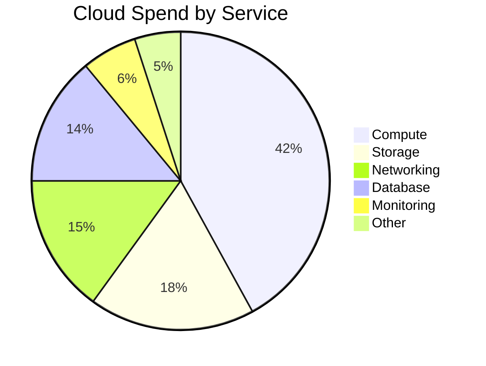
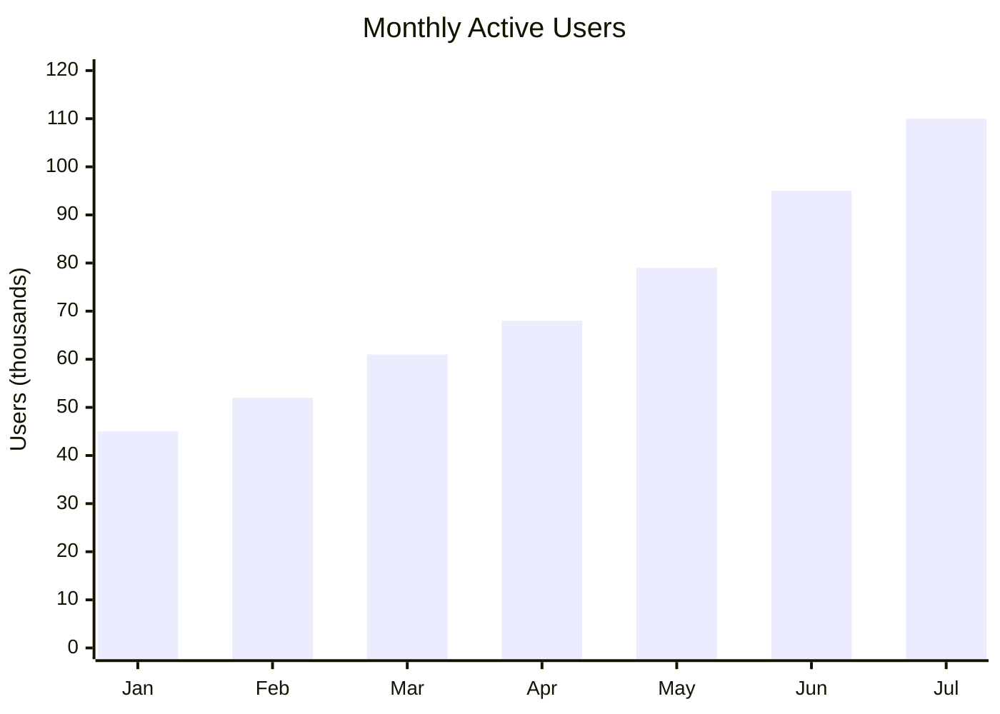

# Diagrams Sample

Sample document showing the diagrams-generator skill in action: flowchart, pie, and bar, each as a simple ASCII version and a bigger Mermaid version.

## Table of Contents

- [Flowchart](#flowchart)
- [Pie Chart](#pie-chart)
- [Bar Chart](#bar-chart)

---

## Flowchart

### Simple (ASCII)

```
[Start] --> [Validate] --> [Process] --> [End]
                |
                v
            [Error]
```

### Bigger (Mermaid)



---

## Pie Chart

### Simple (ASCII)

```
Browser Share
Chrome  [##########........] 50%
Safari  [######............] 30%
Other   [####..............] 20%
```

### Bigger (Mermaid)



---

## Bar Chart

### Simple (ASCII)

```
Requests per hour
09h [####______] 40
10h [#######___] 70
11h [##########] 100
12h [######____] 60
```

### Bigger (Mermaid)


