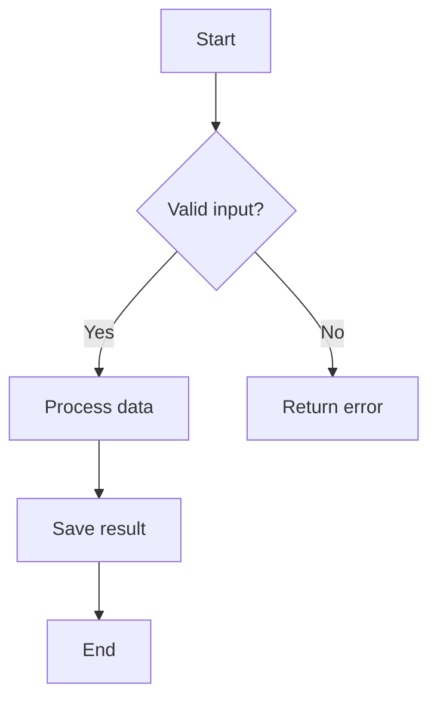
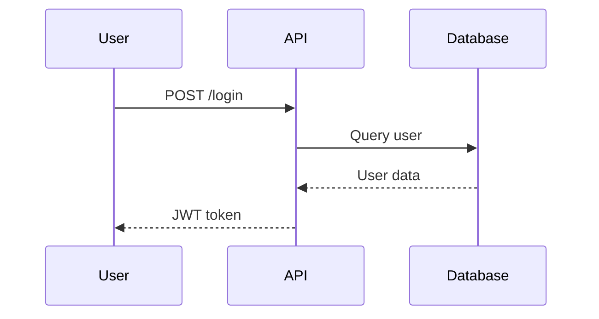
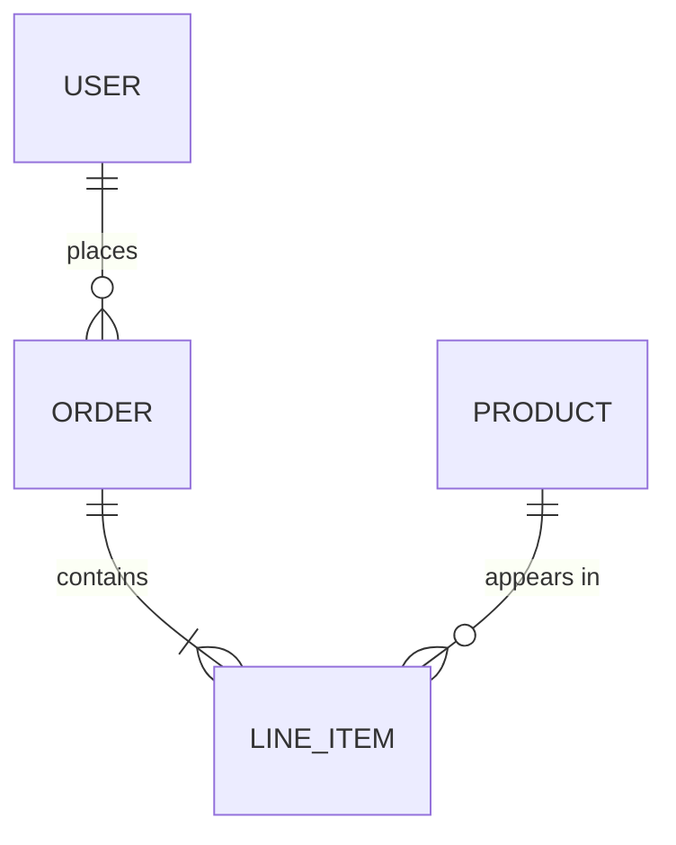
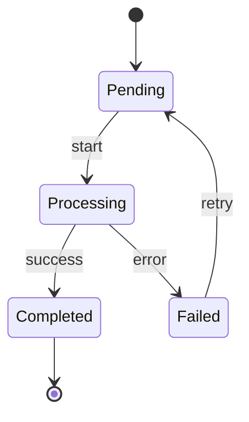
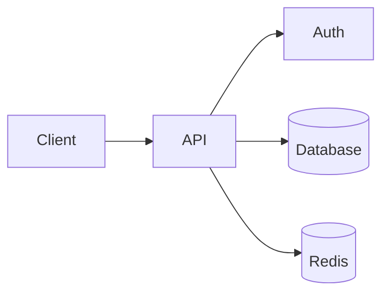
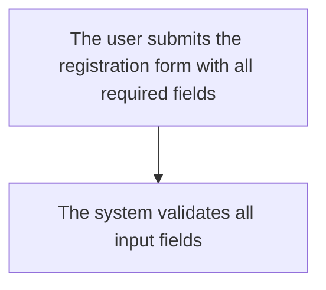

# Diagram Generator

Generate diagrams to visualize non-trivial concepts, architecture, and processes.

## Triggers

Proactively include diagrams when explaining:
- System/component architecture
- Data flows and pipelines
- Multi-step processes or algorithms
- State machines and transitions
- Component interactions over time
- Data models and relationships

Use judgment for complexity. Ask user when uncertain if diagram adds value.

## Diagram Types

| Scenario | Diagram Type | Mermaid Syntax |
|----------|--------------|----------------|
| Process/algorithm flow | Flowchart | `flowchart TD` |
| Component interactions over time | Sequence diagram | `sequenceDiagram` |
| Data models/relationships | ER diagram | `erDiagram` |
| System architecture (simple) | Architecture diagram | `flowchart LR` |
| System architecture (nested/complex) | ASCII boxes | Manual layout |
| State transitions | State machine | `stateDiagram-v2` |
| Class relationships | Class diagram | `classDiagram` |
| Decision trees | Flowchart | `flowchart TD` with `{}` nodes |
| File / directory / component structure | ASCII tree | Plain code fence with `├──` / `└──` (NOT Mermaid) |

## Format Rules

**First gate — pick by output target, before anything else:**

- **Console / terminal / chat reply → ASCII only.** Mermaid does **not** render in a terminal; a `mermaid` fenced block shows the user raw source text, not a diagram. Never emit Mermaid as console output.
- **Markdown document meant for a renderer (plan, report, tech doc, PR body, any `.md`) → Mermaid** (fall back to ASCII only if that renderer is known to lack Mermaid support).

Only when the target is a **document** do diagram *characteristics* choose the type:

| Characteristic | Best Format | Reason |
|----------------|-------------|--------|
| Sequential flows, decision trees | Mermaid | Auto-layouts arrows, handles branching |
| Temporal interactions | Mermaid `sequenceDiagram` | Time-ordered, auto-spacing |
| Data relationships | Mermaid `erDiagram` | Standard notation, auto-layouts |
| Nested containers (boxes-in-boxes) | ASCII | Flexible spatial positioning |
| Complex bidirectional relationships | ASCII | Arrows can point anywhere |
| Mixed flow directions in same diagram | ASCII | No forced hierarchy |
| Hierarchical file / component / directory structure | ASCII tree | Mirrors `tree` output; containment is clearer than flowchart arrows |

**Reminder:** the table above assumes a document target and only picks the *type*. It never overrides the first gate — console/terminal/chat output is ASCII regardless of what the table suggests.

## Style Rules

1. **Concise labels** — max ~20 chars per node
2. **Consistent naming** — use same terms as codebase/docs
3. **One focus per diagram** — single topic, process, or flow
4. **Readable** — no hard node limit but avoid clutter
5. **Direction** — use `TD` (top-down) for flows, `LR` (left-right) for architecture

## Output Rules

| Context | Format | Location |
|---------|--------|----------|
| Building document (plan, report, tech doc, `.md`) | Mermaid | Inline in document |
| Console / terminal / chat reply | ASCII only — never Mermaid | Inline in response |
| Output target unclear | Ask first; `.md` → Mermaid, else ASCII | — |

## Process

1. Identify if scenario warrants diagram (use judgment)
2. Select appropriate diagram type from matrix
3. Draft in Mermaid (document target) or ASCII (console/terminal/chat target) — per the first gate
4. Place in target document
5. If unsure about inclusion or placement → ask

## Examples

### Flowchart (Process)



### Sequence Diagram (Interactions)



### ER Diagram (Data Model)



### State Diagram



### Architecture (Left-to-Right)



### Tree (File / Component / Directory Structure)

Use a plain code fence with `├──`, `│`, `└──` connectors — **not** a Mermaid flowchart. Annotate NEW / REUSED / etc. at the group level to keep it scannable.

```
project/.claude/
├── commands/
│   └── do-thing.md              — NEW · orchestrator
├── skills/                      — NEW · one per phase
│   ├── analyze/SKILL.md
│   └── summarize/SKILL.md
└── agents/                      — REUSED as-is
    ├── fetch-agent.md
    └── report-agent.md
```

## ASCII Fallback Examples

For console output when no document context:

### Simple Flow
```
[Start] --> [Validate] --> [Process] --> [End]
                |
                v
            [Error]
```

### Simple Sequence
```
User        API         DB
  |--login-->|           |
  |          |--query--->|
  |          |<--data----|
  |<--token--|           |
```

### Simple Architecture
```
+--------+     +-----+     +----+
| Client |---->| API |---->| DB |
+--------+     +-----+     +----+
                  |
                  v
              +-------+
              | Cache |
              +-------+
```

## Bad Examples (Avoid)

### Too verbose labels

Too long — simplify to "Submit form" → "Validate input".

### Too many nodes
Avoid cramming entire system into one diagram. Split by concern.

### Missing context
Don't create diagrams that require extensive explanation. Labels should be self-explanatory.

### Structural tree rendered as a flowchart
Don't render a file / component / directory hierarchy as a Mermaid `flowchart` (subgraphs + styled nodes + arrows) — it adds visual noise for what is simple containment. Use a plain ASCII tree (`├── └──`) instead. Reserve `flowchart` for sequence, branching, and data-flow.
