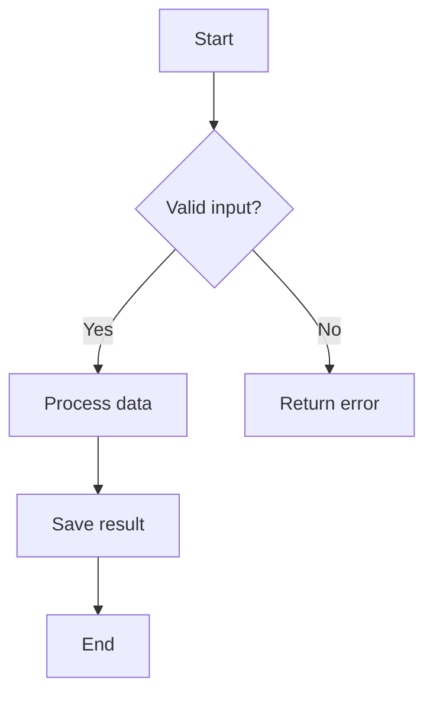
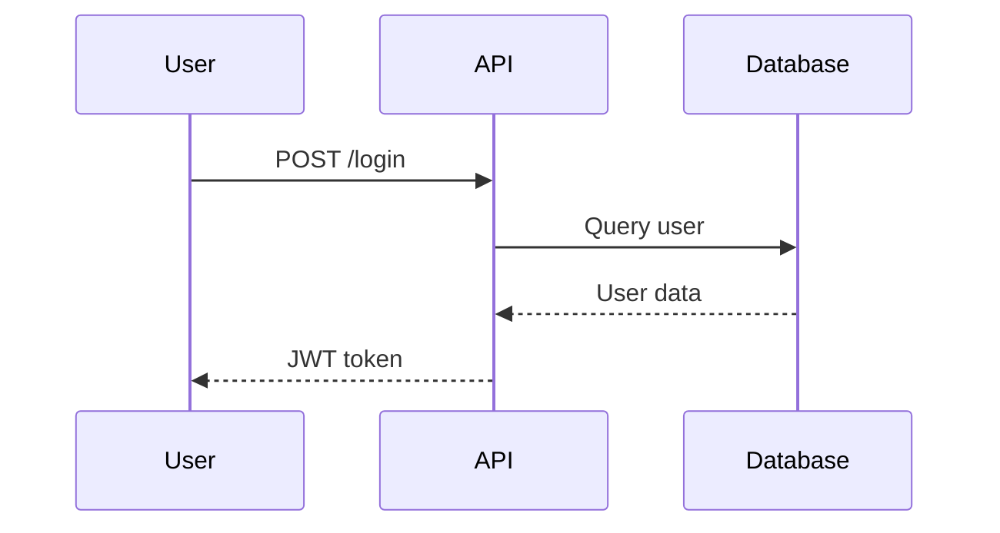
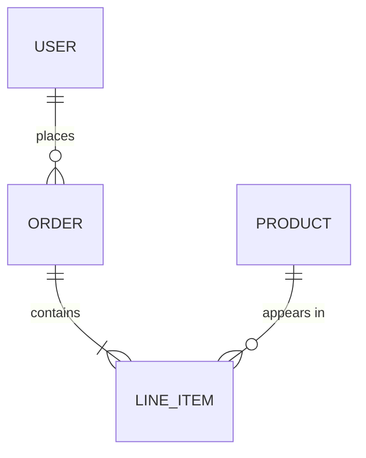
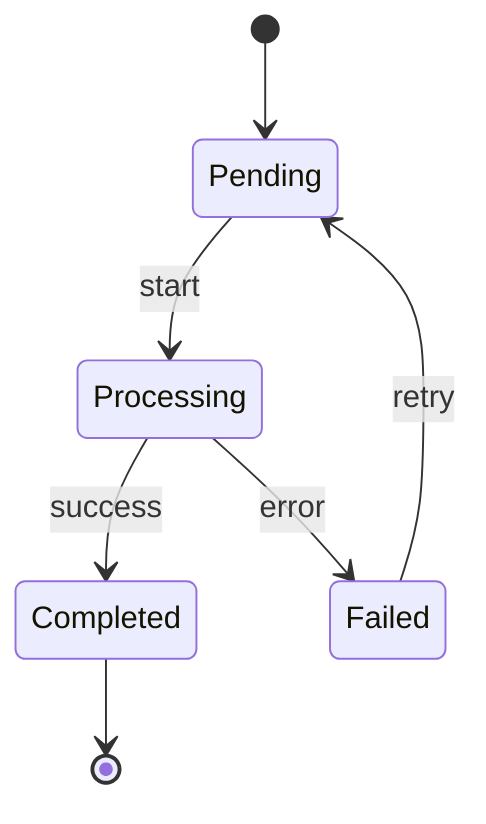
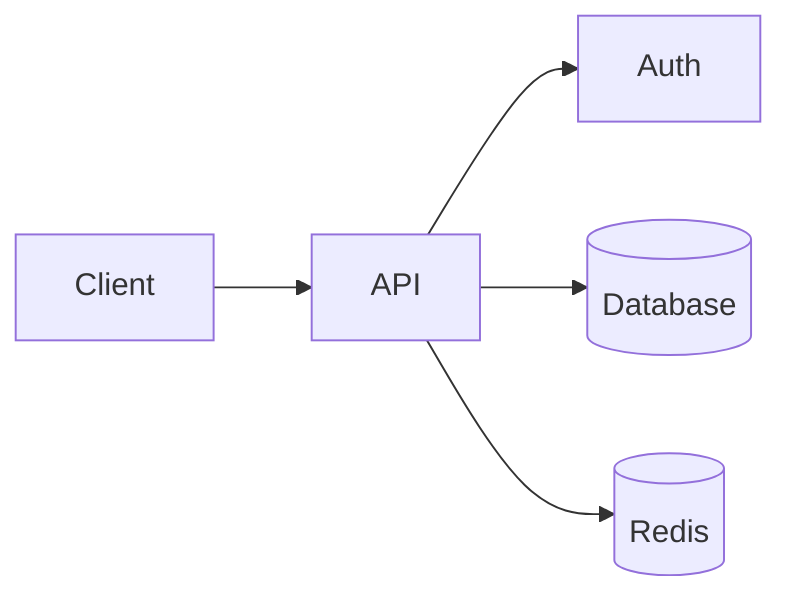
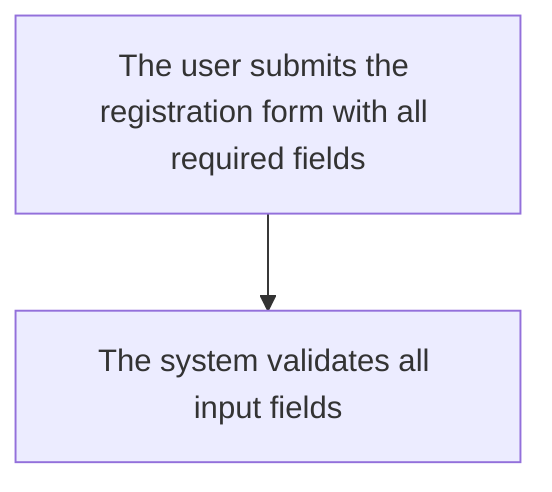

# Diagram Generator

Generate diagrams to visualize non-trivial concepts, architecture, and processes.

## Triggers

Proactively include diagrams when explaining:
- System/component architecture
- Data flows and pipelines
- Multi-step processes or algorithms
- State machines and transitions
- Component interactions over time
- Data models and relationships

Use judgment for complexity. Ask user when uncertain if diagram adds value.

## Diagram Types

| Scenario | Diagram Type | Mermaid Syntax |
|----------|--------------|----------------|
| Process/algorithm flow | Flowchart | `flowchart TD` |
| Component interactions over time | Sequence diagram | `sequenceDiagram` |
| Data models/relationships | ER diagram | `erDiagram` |
| System architecture (simple) | Architecture diagram | `flowchart LR` |
| System architecture (nested/complex) | ASCII boxes | Manual layout |
| State transitions | State machine | `stateDiagram-v2` |
| Class relationships | Class diagram | `classDiagram` |
| Decision trees | Flowchart | `flowchart TD` with `{}` nodes |

## Format Rules

Choose format based on **diagram characteristics**, not just output context:

| Characteristic | Best Format | Reason |
|----------------|-------------|--------|
| Sequential flows, decision trees | Mermaid | Auto-layouts arrows, handles branching |
| Temporal interactions | Mermaid `sequenceDiagram` | Time-ordered, auto-spacing |
| Data relationships | Mermaid `erDiagram` | Standard notation, auto-layouts |
| Nested containers (boxes-in-boxes) | ASCII | Flexible spatial positioning |
| Complex bidirectional relationships | ASCII | Arrows can point anywhere |
| Mixed flow directions in same diagram | ASCII | No forced hierarchy |

**Output context overrides:**
- Console-only output → ASCII (regardless of type)
- Mermaid renderer unavailable → ASCII

## Style Rules

1. **Concise labels** — max ~20 chars per node
2. **Consistent naming** — use same terms as codebase/docs
3. **One focus per diagram** — single topic, process, or flow
4. **Readable** — no hard node limit but avoid clutter
5. **Direction** — use `TD` (top-down) for flows, `LR` (left-right) for architecture

## Output Rules

| Context | Format | Location |
|---------|--------|----------|
| Building document (plan, report, tech doc) | Mermaid | Inline in document |
| Output location unclear | Mermaid | Ask user first |
| Console only (no document) | Simplified ASCII | Inline in response |

## Process

1. Identify if scenario warrants diagram (use judgment)
2. Select appropriate diagram type from matrix
3. Draft in Mermaid syntax (or ASCII for console)
4. Place in target document
5. If unsure about inclusion or placement → ask

## Examples

### Flowchart (Process)



### Sequence Diagram (Interactions)



### ER Diagram (Data Model)



### State Diagram



### Architecture (Left-to-Right)



## ASCII Fallback Examples

For console output when no document context:

### Simple Flow
```
[Start] --> [Validate] --> [Process] --> [End]
                |
                v
            [Error]
```

### Simple Sequence
```
User        API         DB
  |--login-->|           |
  |          |--query--->|
  |          |<--data----|
  |<--token--|           |
```

### Simple Architecture
```
+--------+     +-----+     +----+
| Client |---->| API |---->| DB |
+--------+     +-----+     +----+
                  |
                  v
              +-------+
              | Cache |
              +-------+
```

## Bad Examples (Avoid)

### Too verbose labels

Too long — simplify to "Submit form" → "Validate input".

### Too many nodes
Avoid cramming entire system into one diagram. Split by concern.

### Missing context
Don't create diagrams that require extensive explanation. Labels should be self-explanatory.
